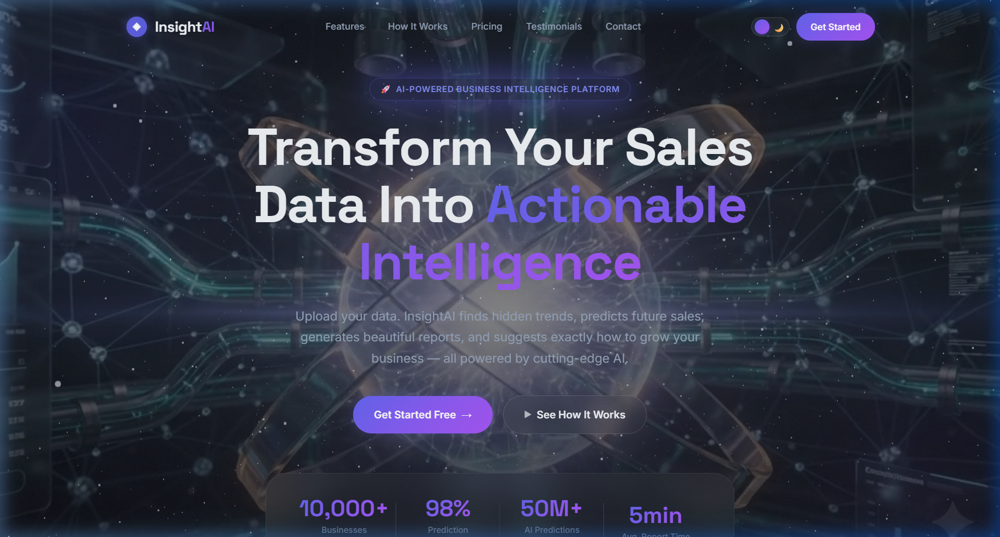
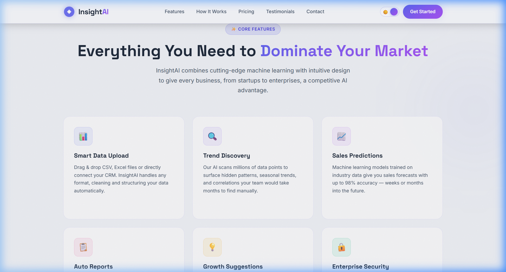
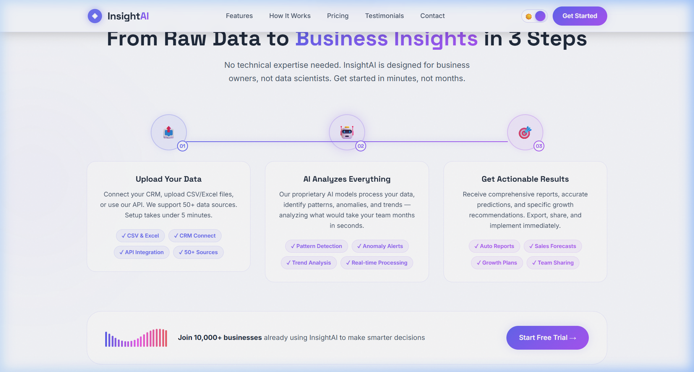
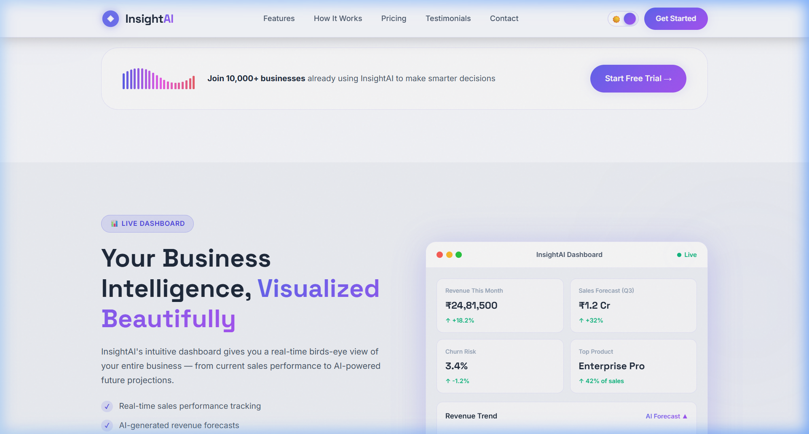
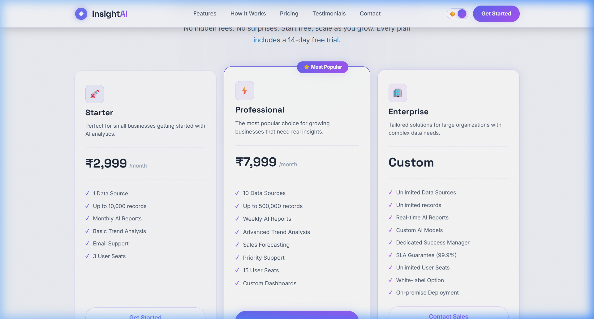
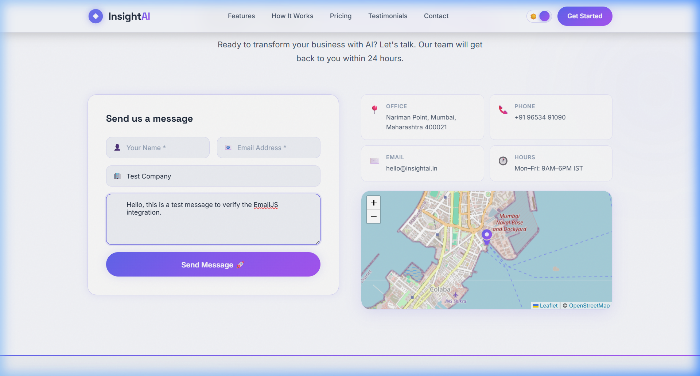
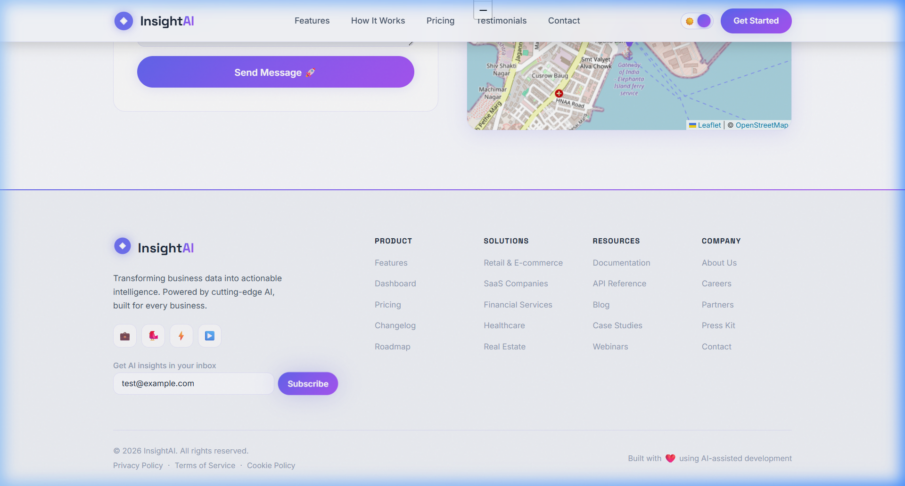

<div align="center">



<br /><br />

<h1>InsightAI &nbsp;—&nbsp; AI-Powered Business Intelligence Platform</h1>

<p>
  Transform your raw sales data into crystal-clear intelligence.<br />
  Upload data. Discover trends. Predict revenue. Grow faster.
</p>

<p>
  <a href="https://isn-insightai.vercel.app"></a>
  &nbsp;
  <a href="https://github.com/meetguptaX/ISN-InsightAI"></a>
  &nbsp;
  
  &nbsp;
  
  &nbsp;
  
</p>

</div>

---

## 📌 Table of Contents

- [Overview](#-overview)
- [Live Preview](#-live-preview)
- [Tech Stack](#-tech-stack)
- [Features](#-features)
- [Screenshots](#-screenshots)
- [Project Structure](#-project-structure)
- [Getting Started](#-getting-started)
- [EmailJS Setup](#-emailjs-setup)
- [Deployment](#-deployment-vercel)
- [Environment Variables](#-environment-variables)
- [Author](#-author)

---

## 🚀 Overview

**InsightAI** is a production-ready SaaS landing page for an AI-powered business intelligence platform. Businesses upload their sales data and InsightAI's AI engine uncovers hidden trends, predicts future revenue, auto-generates reports, and surfaces actionable growth recommendations — all in minutes.

This project was built as an **interview assessment for iSN Business Solutions LLP**, demonstrating:

- ⚡ Modern React + Vite SPA architecture
- 🎨 Premium UI/UX with glassmorphism, dark/light mode, and micro-animations
- 📦 Integration of **7 external libraries** in a production-grade codebase
- 📱 Fully responsive across mobile, tablet, and desktop

---

## 👁️ Live Preview

> 🔗 **[https://isn-insightai.vercel.app](https://isn-insightai.vercel.app)**

<div align="center">
  
  <br /><sub>Hero Section — Dual-video cinematic background with 3D particle field (Three.js)</sub>
</div>

---

## 🛠️ Tech Stack

| Category | Technology | Version | Purpose |
|---|---|---|---|
| **Framework** | React | 18.3 | Component-based UI architecture |
| **Build Tool** | Vite | 5.4 | Lightning-fast dev server & bundler |
| **Scroll Animations** | GSAP + ScrollTrigger | 3.12 | Scroll reveals, counter animations, timeline sequences |
| **UI Animations** | Framer Motion | 11 | Hover effects, carousel transitions, modal animations |
| **Lottie** | Lottie React | 2.4 | Animated AI bar chart visualization |
| **3D Graphics** | Three.js + React Three Fiber | 8.17 | Rotating 3D particle sphere overlay on hero |
| **Email** | EmailJS | 4.4 | Fully working contact form (no backend) |
| **Maps** | React Leaflet + Leaflet | 4.2 / 1.9 | Interactive office map (OpenStreetMap) |
| **Theme** | Custom CSS Variables | — | Dark ↔ Light mode with localStorage persistence |
| **Styling** | Vanilla CSS | — | Custom design system with CSS variables |

---

## ✨ Features

### 🎬 Animations & Visual Experience
- **Seamless dual-video hero background** — Two AI-generated videos loop without gaps via the `ended` DOM event
- **3D rotating particle field** — Built with React Three Fiber, `useFrame` hook for 60fps performance
- **GSAP ScrollTrigger** — Every section triggers staggered reveals, counter increments, and timeline progress
- **Framer Motion AnimatePresence** — Smooth `mount/unmount` transitions on testimonial carousel
- **Glassmorphism** — `backdrop-filter` frosted glass panels throughout

### 🧩 10 Complete Sections
| # | Section | Highlights |
|---|---|---|
| 1 | **Navbar** | Sticky glassmorphic, smooth scroll links, hamburger mobile menu |
| 2 | **Hero** | Dual-video BG, 3D particles, GSAP text reveal, animated stat counters |
| 3 | **Logo Marquee** | Infinite CSS scroll of brand/partner logos |
| 4 | **Features** | 6 glassmorphic cards, hover lift effect, GSAP stagger |
| 5 | **How It Works** | 3-step animated timeline with GSAP line draw |
| 6 | **Dashboard** | Live-data mockup with animated bar chart & KPI cards |
| 7 | **Testimonials** | Auto-advance carousel with Framer Motion AnimatePresence |
| 8 | **Pricing** | 3 tiers, animated "Most Popular" badge, hover states |
| 9 | **Contact** | Working EmailJS form + Leaflet interactive map |
| 10 | **Footer** | 4-column links, newsletter input, social links |

### 🌗 Dark / Light Mode
- System preference auto-detected on first load (`prefers-color-scheme`)
- Toggle persisted in `localStorage`
- CSS variables swap the entire design token set instantly

### 📧 Working Contact Form
- Real email delivery via **EmailJS** (no backend/server required)
- Form validation, loading spinner, success & error states
- Animated success confirmation with Framer Motion spring

---

## 📸 Screenshots

<table>
  <tr>
    <td align="center" width="50%">
      
      <br /><sub><b>Features Section</b> — 6 glassmorphic cards with GSAP stagger</sub>
    </td>
    <td align="center" width="50%">
      
      <br /><sub><b>How It Works</b> — 3-step animated timeline</sub>
    </td>
  </tr>
  <tr>
    <td align="center" width="50%">
      
      <br /><sub><b>Dashboard Mockup</b> — Live KPI cards + AI forecast bar chart</sub>
    </td>
    <td align="center" width="50%">
      
      <br /><sub><b>Pricing</b> — 3 tiers with animated "Most Popular" badge</sub>
    </td>
  </tr>
  <tr>
    <td align="center" width="50%">
      
      <br /><sub><b>Contact + Leaflet Map</b> — Working form & interactive Mumbai map</sub>
    </td>
    <td align="center" width="50%">
      
      <br /><sub><b>Footer</b> — Multi-column links, newsletter & socials</sub>
    </td>
  </tr>
</table>

---

## 📁 Project Structure

```
ISN-InsightAI/
├── public/
│   ├── videos/
│   │   ├── hero-bg-1.mp4          # Hero video 1 (AI/tech theme)
│   │   └── hero-bg-2.mp4          # Hero video 2 (seamless transition)
│   ├── screenshots/               # README screenshots
│   └── favicon.svg
├── src/
│   ├── components/
│   │   ├── Navbar/
│   │   │   ├── Navbar.jsx         # Sticky nav, mobile hamburger, scroll links
│   │   │   └── Navbar.css
│   │   ├── Hero/
│   │   │   ├── Hero.jsx           # Dual-video BG, GSAP text, stat counters
│   │   │   ├── Hero.css
│   │   │   └── ParticleField.jsx  # React Three Fiber 3D particle sphere
│   │   ├── LogoMarquee/
│   │   ├── Features/
│   │   ├── HowItWorks/
│   │   ├── Dashboard/
│   │   ├── Testimonials/
│   │   ├── Pricing/
│   │   ├── Contact/               # EmailJS form + Leaflet map
│   │   └── Footer/
│   ├── context/
│   │   └── ThemeContext.jsx       # Global dark/light theme state
│   ├── hooks/
│   │   └── useScrollAnimation.js  # Reusable GSAP scroll hooks
│   ├── App.jsx                    # Root component, section assembly
│   ├── main.jsx                   # React entry point
│   └── index.css                  # Global design system & CSS variables
├── .env                           # EmailJS credentials (not committed)
├── .env.example                   # Template for required env vars
├── vite.config.js                 # Vite config with code-splitting
├── vercel.json                    # Vercel SPA routing config
└── package.json
```

---

## 🏁 Getting Started

### Prerequisites
- **Node.js** ≥ 18.x (tested on Node 21)
- **npm** ≥ 9.x

### Installation

```bash
# 1. Clone the repository
git clone https://github.com/meetguptaX/ISN-InsightAI.git
cd ISN-InsightAI

# 2. Install all dependencies
npm install

# 3. Set up environment variables
cp .env.example .env
# → Fill in your EmailJS credentials (see section below)

# 4. Start the development server
npm run dev
```

The app will be running at **http://localhost:5173** 🚀

### Available Scripts

```bash
npm run dev      # Start Vite dev server with HMR
npm run build    # Build optimised production bundle → dist/
npm run preview  # Preview the production build locally
```

---

## 📧 EmailJS Setup

The contact form uses [EmailJS](https://emailjs.com) — fully client-side email sending, zero backend needed.

**Step 1 — Create a free account** at [emailjs.com](https://emailjs.com)

**Step 2 — Add an Email Service**
- Dashboard → **Email Services** → **Add New Service**
- Connect your Gmail (or any provider)
- Copy the **Service ID** → e.g. `service_abc123`

**Step 3 — Create an Email Template**

Create a new template with these exact variable names:

```
Subject : New Contact Form Submission - InsightAI
From    : {{user_name}}
Reply-To: {{user_email}}

Body:
  Name    : {{user_name}}
  Email   : {{user_email}}
  Company : {{company}}
  Message : {{message}}
```

Copy the **Template ID** → e.g. `template_xyz789`

**Step 4 — Get your Public Key**
- **Account** → **API Keys** → Copy **Public Key**

**Step 5 — Update `.env`**

```env
VITE_EMAILJS_SERVICE_ID=service_abc123
VITE_EMAILJS_TEMPLATE_ID=template_xyz789
VITE_EMAILJS_PUBLIC_KEY=your_public_key
```

> ⚠️ **Never commit `.env` to Git.** It is already in `.gitignore`.

---

## 🚀 Deployment (Vercel)

### Option A — via Vercel CLI

```bash
# Install Vercel CLI globally
npm install -g vercel

# Login to your Vercel account
vercel login

# Deploy (follow the prompts — all defaults work)
vercel
```

### Option B — via GitHub Integration (Recommended)

1. Push this repository to GitHub
2. Go to [vercel.com/new](https://vercel.com/new) and **Import** your GitHub repo
3. Vercel auto-detects Vite — no config changes needed
4. In **Settings → Environment Variables**, add your 3 EmailJS keys
5. Click **Deploy** — your site is live in ~60 seconds 🎉

### `vercel.json` — SPA Routing

The included `vercel.json` ensures all routes serve `index.html` (required for React SPA):

```json
{
  "routes": [
    { "handle": "filesystem" },
    { "src": "/.*", "dest": "/index.html" }
  ]
}
```

---

## 🔐 Environment Variables

| Variable | Required | Description |
|---|---|---|
| `VITE_EMAILJS_SERVICE_ID` | ✅ Yes | Your EmailJS Email Service ID |
| `VITE_EMAILJS_TEMPLATE_ID` | ✅ Yes | Your EmailJS Email Template ID |
| `VITE_EMAILJS_PUBLIC_KEY` | ✅ Yes | Your EmailJS account Public Key |

Copy `.env.example` → `.env` and fill in your values.

---

## 🎨 Design System

| Token | Value | Usage |
|---|---|---|
| `--accent-primary` | `#6366f1` (Indigo) | Buttons, highlights, links |
| `--accent-secondary` | `#a855f7` (Violet) | Gradient ends, badges |
| `--bg-primary` | `#0a0b1a` (dark) / `#f0f2f8` (light) | Page background |
| `--glass-bg` | `rgba(255,255,255,0.04)` | Card backgrounds |
| Font Primary | **Inter** (Google Fonts) | Body text |
| Font Display | **Space Grotesk** | Headings, numbers |

---

## 🏗️ Performance & Build

Code-split into 4 vendor chunks for optimal caching:

| Chunk | Libraries | Gzipped |
|---|---|---|
| `react-vendor` | react, react-dom | ~0.1 kB |
| `animation-vendor` | framer-motion, gsap | ~71 kB |
| `three-vendor` | three.js, R3F, Drei | ~263 kB |
| `map-vendor` | leaflet, react-leaflet | ~45 kB |
| `index` | App code | ~32 kB |

---

## 👤 Author

<div align="center">

**Meet Gupta**

Built as an interview assessment for **iSN Business Solutions LLP**

<br />

[](https://linkedin.com/in/meetgupta)
&nbsp;
[](https://github.com/meetguptaX)

</div>

---

## 📄 License

This project is licensed under the **MIT License** — feel free to use it as a reference or template.

---

<div align="center">

Made with ❤️ and a lot of ☕ &nbsp;|&nbsp; Powered by AI-assisted development

<br />

⭐ **If you found this useful, please give it a star!** ⭐

</div>
